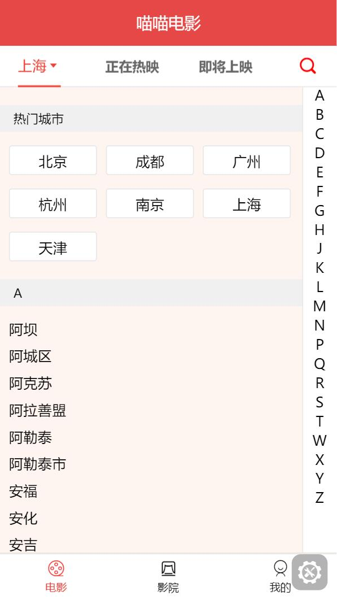

# miaomiao

## 前端技术栈

- Typescript
- Sass
- Vue

## 项目截图




- 项目演示地址就不说了......

## 项目介绍

- 使用vue-cli3脚手架构建，用ts，vue，sass集成开发的

- 本项目只做了前端部分

- 由于使用的是教学视频中的接口，目前已失效！可以用 birdmock（package.json中有该依赖）进行模拟。。。

## birdmock（结合mockjs开发的本地mock服务）

### mock配置

- 优先读取mocksPath的路径，否则需要在项目执行命令下的那个目录建立mocks文件夹！！！

- 接口放在指定路径（如果指定了mocksPath的路径）或mocks目录下

```js
module.exports = {
    'user/getInfo' : () => {
        a: 2
    },
    'user/login': {
    }
}
```

### vue.config.js

``` js

// vue.config.js的样例
var appConfig = require('.birdmock/config.json');
// 服务器存放打包文件的目录
var publicPath = '/目录';
if (process.env.NODE_ENV === 'dev') { // 开发环境
    publicPath = '/';
}
module.exports = {
    // 配置静态资源访问的根文件夹
    publicPath: publicPath,
    devServer: {
        overlay: {
            warnings: false, // 消除警告
            errors: true
        },
        proxy: appConfig.proxy
    }
}
```

### package.json

``` json
"scripts": {
    "serve": "vue-cli-service serve",
    "build": "vue-cli-service build",
    "lint": "vue-cli-service lint",
    "start": "cross-env NODE_ENV=dev vue-cli-service serve",
    "mock": "birdmock",
    "mock:proxy": "cross-env proxy=http://39.97.33.178:80 birdmock"
  }
```

#### 如果觉得本项目对您点作用，也可以给个star噢~
